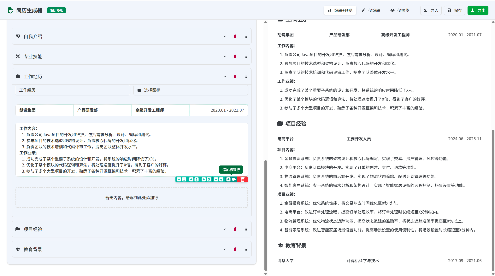
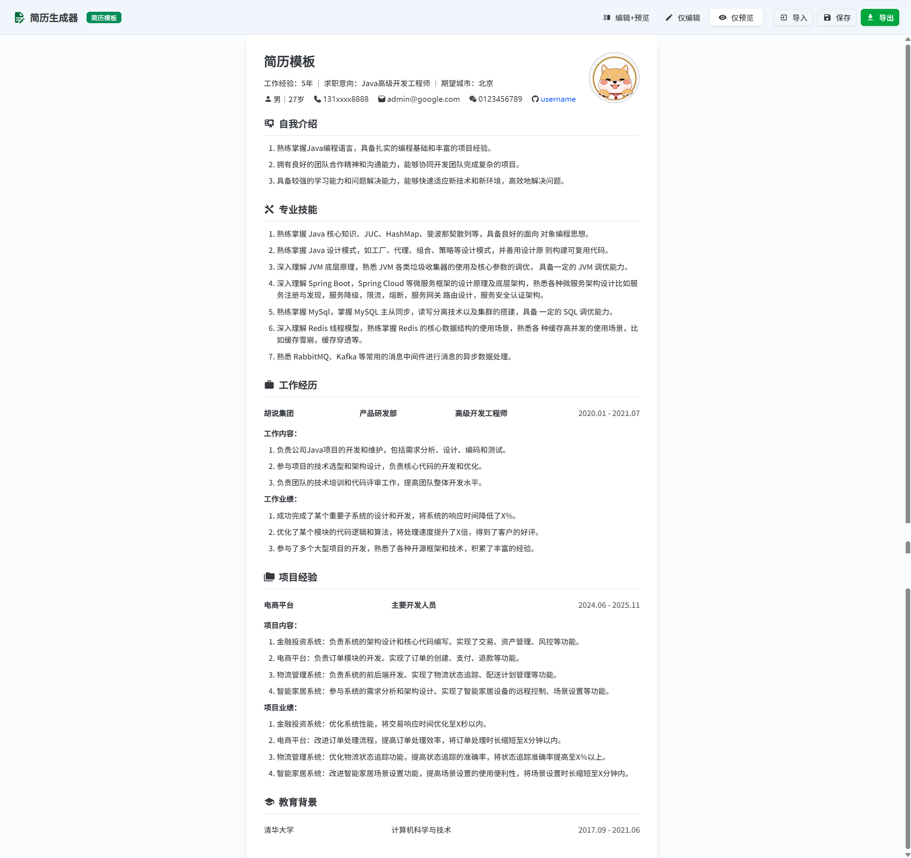

# 简历生成器
> ⭐⭐⭐ **如果这个项目对您有帮助，请给个小星星！** 您的支持是我持续改进和添加新功能的动力。

一个灵活且功能强大的简历构建和导出工具，帮助用户快速创建、编辑和导出干净、简洁而又专业的简历，支持所见即所得。

## 功能特点

- **简历编辑**: 直观的界面，轻松编辑个人信息和简历内容
- **模块化设计**: 支持添加、删除和重排简历模块
- **实时预览**: 即时查看简历编辑效果
- **PDF导出**: 优先由服务端 Chromium 渲染同一份 HTML/CSS 生成干净 PDF；不可用时自动降级浏览器打印，并给出引导
- **图片导出**: 支持导出为 PNG、JPG、WEBP、SVG 等图片格式
- **数据保存**: 支持保存和导入简历数据
- **富文本支持**: 支持自由设置文本格式，如字体、文字大小、颜色、对齐方式以及是否加粗、URL链接等
- **自适应**: 支持不同模块/布局自由组合，自动调整元素尺寸

## 页面示例截图

1. 编辑和预览：随时查看渲染效果


2. 仅编辑：专注于编写


3. 仅预览：简历效果一览无余


4. 自由布局：左对齐/居中对齐、列数调整等多个选项随心控制


5. 多种导出方式：不同成品满足不同需求


6. 标签功能：为企业或项目等添加标签，让HR/面试官快速理解你


## 技术栈

- **前端框架**: Next.js
- **UI组件**: Shadcn UI
- **样式**: Tailwind CSS
- **PDF生成**: puppeteer-core + @sparticuz/chromium（Serverless 友好）
- **图标**: Iconify

## 快速开始

### 安装依赖

```bash
# 使用pnpm安装依赖
pnpm install
```

### 开发环境运行

```bash
pnpm dev
```

应用将在 [http://localhost:3000](http://localhost:3000) 启动。本地如未安装 `puppeteer-core` 和 `@sparticuz/chromium`，将自动降级为浏览器打印；要在本地使用服务端 PDF，请安装：

```
pnpm add -S puppeteer-core @sparticuz/chromium
```

### 构建生产版本

```bash
pnpm build
```

## 项目结构
```
/
├── app/
│  ├── globals.css
│  ├── layout.tsx
│  ├── page.tsx
│  ├── pdf/preview/[filename]/page.tsx  # 在线 PDF 预览页（配合服务端/浏览器两种模式）
│  ├── print/page.tsx                   # 打印专用页面（供 Chromium 渲染）
│  └── api/pdf/
│     ├── health/route.ts               # 健康检查（尝试启动 headless 浏览器）
│     ├── [filename]/route.ts           # 生成并缓存 PDF（POST 303 重定向到 GET 下载/预览）
│     └── route.ts                      # 直接生成并返回 PDF（Puppeteer + Chromium）
├── components/
│  ├── resume-builder.tsx               # 简历编辑主界面
│  ├── resume-preview.tsx               # HTML 预览（PDF 与预览同源 HTML/CSS）
│  ├── print-content.tsx                # 打印内容容器
│  ├── pdf-viewer.tsx                   # 自动选择：服务端 PDF 或浏览器打印
│  └── ui/…                             # Shadcn UI 基础组件集合
├── hooks/
│  ├── use-mobile.ts
│  └── use-toast.ts
├── lib/
│  └── resume-utils.ts
├── styles/
│  ├── globals.css
│  ├── print.css                        # 打印样式
│  └── tiptap.css                       # 富文本编辑器样式
├── public/
│  ├── NotoSansSC-Medium.ttf            # 字体（预览/打印共用）
│  ├── template.re                       # 示例简历数据
│  └── …
└── types/
   └── resume.ts
```

## 简历数据
```typescript
export interface ResumeFile {
  version: string;
  data: ResumeData;
  metadata: {
    exportedAt: string;
    appVersion: string;
  };
}

export interface ResumeData {
  title: string;                     // 简历标题/姓名
  centerTitle?: boolean;             // 标题是否居中
  personalInfoSection: PersonalInfoSection; // 个人信息模块（支持 inline/grid）
  jobIntentionSection?: JobIntentionSection; // 求职意向模块（可选）
  modules: ResumeModule[];           // 其它模块（教育/经历/项目等）
  avatar?: string;                   // 头像 URL（可为 data:URL）
  createdAt: string;
  updatedAt: string;
}
```

## 功能说明
> 基于 [resume-builder](https://github.com/magicyan418/resume-builder) 二次开发，感谢原作者的开源。

### 个人信息编辑

支持添加、编辑和删除个人信息项，如姓名、电话、邮箱等。每个信息项可以设置标签、值和图标。

### 求职意向

支持添加、编辑和删除个人求职意向、期望薪资、目标城市等信息。

### 简历模块

支持多种类型的简历模块，如教育背景、工作经历、项目经验等。每个模块可以包含标题、图标、和详细内容。

### PDF 导出（服务端优先，自动降级）

- 服务端优先：`POST /api/pdf` 使用 `puppeteer-core + @sparticuz/chromium` 打开`/print`，通过`sessionStorage`传入数据，设置`displayHeaderFooter:false`、`printBackground:true`、`preferCSSPageSize:true`，返回干净的`application/pdf`（inline）。
- 降级体验：若服务端不可用或失败，自动使用浏览器打印（所见即所得），界面会提示：
  - 关闭“页眉和页脚”
  - 勾选“背景图形”

环境变量（可选）
- `NEXT_PUBLIC_FORCE_SERVER_PDF=true` 强制使用服务端 PDF
- `NEXT_PUBLIC_FORCE_PRINT=true` 强制使用浏览器打印

接口说明
- `GET /api/pdf/health`：健康检查，验证 headless 启动能力
- `POST /api/pdf`：传入`{ resumeData }`，直接返回`application/pdf`
- `POST /api/pdf/:filename`：传入`{ resumeData }`，生成后返回`303`到`GET /api/pdf/:filename?token=...`（便于内联预览/下载）
- `GET /api/pdf/:filename?token=...`：短期缓存（约 5 分钟）内联返回 PDF
### 部署到 Vercel

- 仅支持 Node.js Runtime 的 Serverless Functions（不是 Edge）。
- 我们在 `route.ts` 中声明了 `export const runtime = 'nodejs'` 与 `dynamic = 'force-dynamic'`。
- 依赖：`puppeteer-core`、`@sparticuz/chromium`（Serverless 友好）。无需打包二进制。
- 建议在项目设置提升函数超时与内存（如 1024MB/1536MB）。

### 数据导入导出

支持将简历数据导出为`.re`文件，也可以从文件导入数据（`JSON`格式）。

## 自定义主题

项目使用Tailwind CSS进行样式管理，可以通过修改`tailwind.config.js`文件自定义主题颜色和其他样式。

## 许可证

MIT


